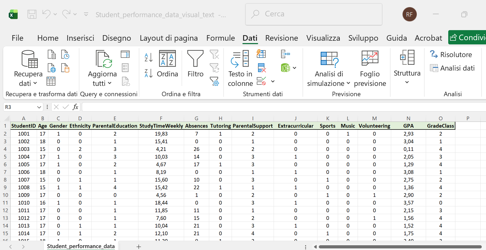
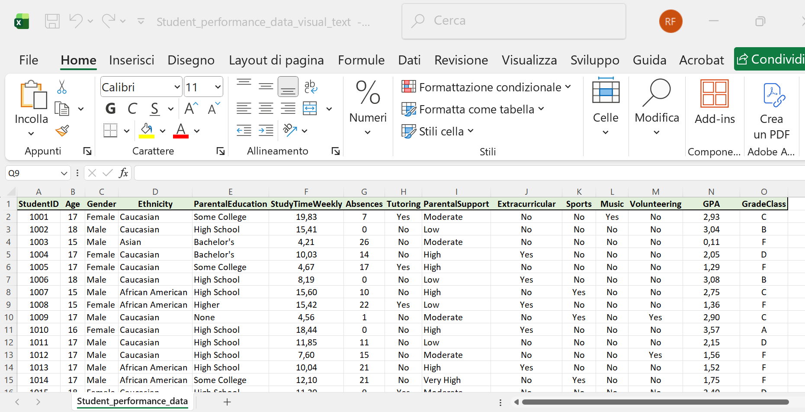
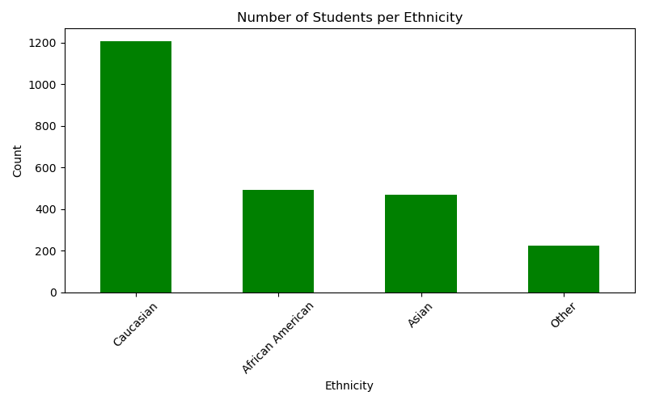
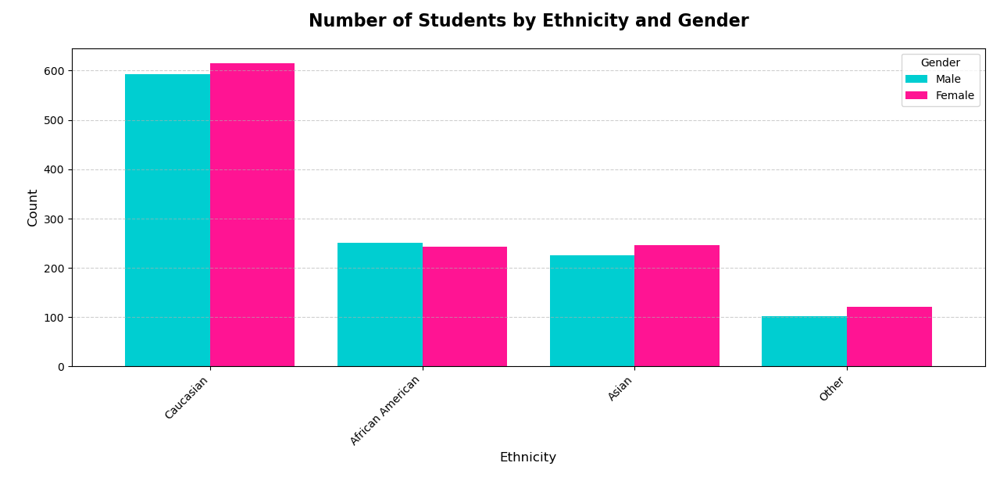
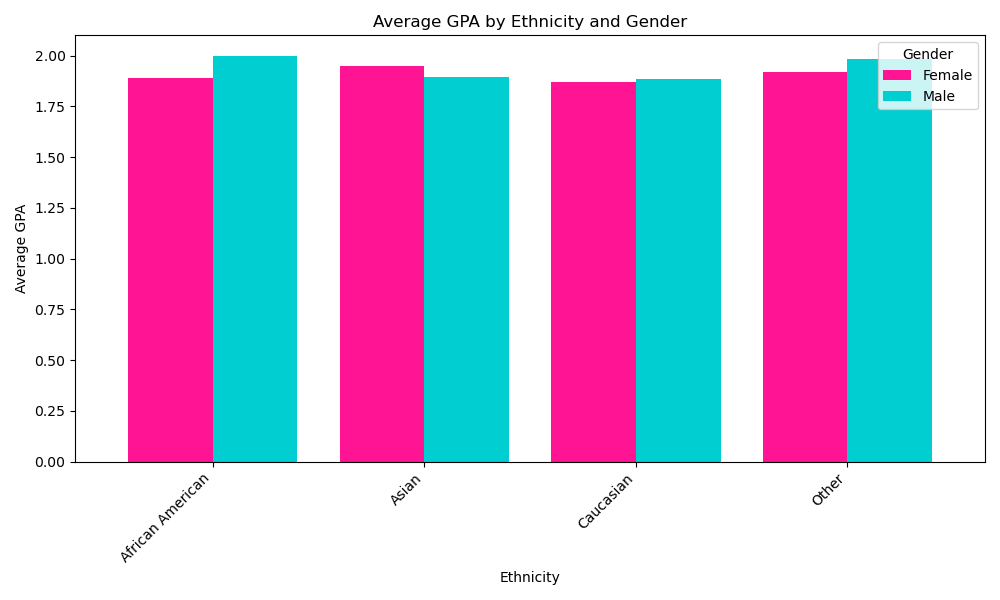
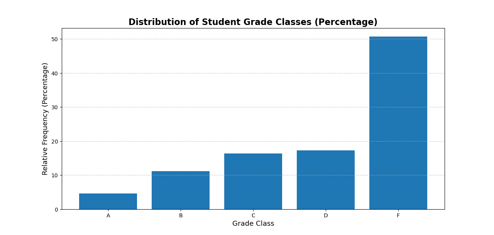

## 📚 Dataset Details: `Student_performance_data.csv`

### 1. Source and Overview

The data used for this analysis is sourced from the `Student_performance_data_.csv` file, originally referenced in the Kaggle notebook: [https://www.kaggle.com/code/annastasy/predicting-students-grades/input](https://www.kaggle.com/code/annastasy/predicting-students-grades/input)

> This dataset is a widely **available anonymized compilation** of **2,392 records** (Student ID from 1001 to 3392), often associated with secondary school student data (potentially sourced from a U.S. school context). It contains key attributes related to student performance, including **demographics, social factors, study habits, and final grades**.

---

### 2. Column Dictionary (Feature Descriptions)

This section details all 15 columns, including the necessary code mappings for the analysis.

#### Identification and Demographics

| Feature | Description | Range / Mapping |
| :--- | :--- | :--- |
| **StudentID** | A unique identifier assigned to each student. | 1001 to 3392 |
| **Age** | The age of the students. | 15 to 18 years |
| **Gender** | Gender of the students (Binary). | **0**: Male, **1**: Female |
| **Ethnicity** | The ethnicity of the students (Categorical). | **0**: Caucasian, **1**: African American, **2**: Asian, **3**: Other |

#### Parental and Social Factors

| Feature | Description | Mapping |
| :--- | :--- | :--- |
| **ParentalEducation** | The education level of the parents (Ordinal). | **0**: None, **1**: High School, **2**: Some College, **3**: Bachelor's, **4**: Higher |
| **ParentalSupport** | The level of parental support (Ordinal). | **0**: Very Low, **1**: Low, **2**: Moderate, **3**: High, **4**: Very High |

#### Study and Extracurricular Habits

| Feature | Description | Range / Mapping |
| :--- | :--- | :--- |
| **StudyTimeWeekly** | Weekly study time in hours (Continuous). | 0 to 20 hours |
| **Absences** | Number of absences during the school year. | 0 to 30 |
| **Tutoring** | Tutoring status (Binary). | **0**: No, **1**: Yes |
| **Extracurricular** | Participation in extracurricular activities (Binary). | **0**: No, **1**: Yes |
| **Sports** | Participation in sports (Binary). | **0**: No, **1**: Yes |
| **Music** | Participation in music activities (Binary). | **0**: No, **1**: Yes |
| **Volunteering** | Participation in volunteering (Binary). | **0**: No, **1**: Yes |

#### Academic Performance (Target Variables)

| Feature | Description | Mapping |
| :--- | :--- | :--- |
| **GPA** | **Grade Point Average** on a continuous scale. | 0.0 to 4.0 |
| **GradeClass** | **Target Variable:** Classification of final grades based on GPA (Ordinal). | **0**: 'A' (GPA $\geq 3.5$) / **1**: 'B' ($3.0 \leq$ GPA $< 3.5$) / **2**: 'C' ($2.5 \leq$ GPA $< 3.0$) / **3**: 'D' ($2.0 \leq$ GPA $< 2.5$) / **4**: 'F' (GPA $< 2.0$) |

---

## 🖼️ 3. Initial Data Inspection in Excel

### 3.1. CSV Load and Formatting (`Student_performance_data_visual.xlsx`)

The raw CSV file presented issues upon initial loading due to the US/UK format (dot `.` as decimal separator) conflicting with local Excel settings. This caused the numerical columns (**`StudyTimeWeekly`** and **`GPA`**) to display incorrect, long values.

The data was corrected using the "Text to Columns" feature, specifying the dot as the decimal separator, and the file was saved as **`Student_performance_data_visual.xlsx`** for visual inspection.



*Figure 1: Initial load of the raw CSV in Excel, showing formatting issues in numerical columns before correction.*


---

### 3.2. Categorical Variable Decoding (`Student_performance_data_visual_text.xlsx`)

For maximum readability and initial analysis in Excel, the numeric codes (e.g., `0`, `1`, `2`) in columns like **`Ethnicity`**, **`ParentalEducation`**, **`Tutoring`**, and **`GradeClass`** were manually converted to their corresponding text labels (`Caucasian`, `High School`, `Yes`, `A`, etc.).

This conversion was performed using **IF or IFS formulas** (e.g., `=PIÙ.SE(...)`) directly in the spreadsheet columns. The result was saved as **`Student_performance_data_visual_text.xlsx`**.



*Figure 2: Data view after manual decoding of categorical variables in Excel, providing human-readable labels.*

> **⚠️ Note on Process & Next Steps:** Executing these numerous conversions using Excel formulas is a **manual, time-consuming, and inflexible process**. This approach is not suitable for automation or large-scale data analysis.
> 
> Therefore, for the upcoming analysis in **Pandas**, we will switch back to the original **`Student_performance_data.csv`** file. We will implement the same decoding and transformation logic **programmatically** using Python's Pandas library (`.map()`, `.replace()`, etc.). This method is faster, scalable, and fully reproducible.

---

## 4. 🐍 Data Analysis Setup (Pandas)

To ensure the analysis is scalable and fully reproducible, all subsequent steps use the original **`Student_performance_data.csv`** file and the Python library **Pandas**.

### 4.1. Loading and Decoding Raw Data

The numeric codes (e.g., `0`, `1`, `2`) from the raw data are transformed into human-readable text labels using Pandas' `.map()` function and **Conversion Dictionaries**. This process creates **five new decoded columns** while preserving the original numeric data.

| Original Column | Conversion Type | New Decoded Column |
| :--- | :--- | :--- |
| **Gender** | `{0: 'Male', 1: 'Female'}` | **Gender_Decoded** |
| **Ethnicity** | `{0: 'Caucasian', ...}` | **Ethnicity_Decoded** |
| **ParentalEducation** | `{0: 'None', ...}` | **Education_Decoded** |
| **Tutoring** | `{0: 'No', 1: 'Yes'}` | **Tutoring_Decoded** |
| **GradeClass** | `{0: 'A', 4: 'F'}` | **GradeClass_Decoded** |

The Python code below defines the conversion logic and applies it to the DataFrame:

```python
# Load CSV
df = pd.read_csv("Student_performance_data.csv")

# Conversion Dictionaries defined here...

# Apply Conversions
df['Ethnicity_Decoded'] = df['Ethnicity'].map(ethnicity_conversion)
# ... other conversions applied ...
```

### 4.2. Ethnicity Distribution Count

The following table summarizes the raw count of students for each ethnicity category, based on the 'Ethnicity_Decoded' column:

| Ethnicity Category   | Number of Students (Count) |
| :--- | :--- |
| **Caucasian**        | 1207                       |
| **African American** | 493                        |
| **Asian**            | 470                        |
| **Other**            | 222                        |
| **Total Students**   | 2392                       |

The analysis shows a clear **imbalance (skew)** in the dataset, with the Caucasian group representing over half of the student population.



*Figure 3: Distribution of student population by ethnicity. The chart visually confirms that the majority of students are in the Caucasian category, highlighting a demographic bias in the dataset.*

### 4.3. Demographic Distribution by Gender

To gain a deeper understanding of the dataset's composition, the student population count is **segmented by both Ethnicity and Gender**. This analysis reveals the distribution of males and females within each ethnic group.

### Segmentation Summary

The table below shows the exact breakdown of the student population across the two demographic dimensions:

| Ethnicity Category | Male (Count) | Female (Count) | Total |
| :--- | :--- | :--- | :--- |
| **Caucasian** | 598 | 609 | 1207 |
| **African American** | 240 | 253 | 493 |
| **Asian** | 238 | 232 | 470 |
| **Other** | 115 | 107 | 222 |
| **Total Students** | **1191** | **1201** | **2392** |

The total number of male (**1191**) and female (**1201**) students is nearly equal, indicating **gender balance** within the overall dataset.

### Python Implementation (`student_data_analysis.py`)

The chart is generated using the corrected Python code, which first enforces the desired X-axis order and then applies custom labels and colors to the gender segments.

### Screenshot and Summary



*Figure 4: Distribution of the student population segmented by Ethnicity and Gender. The chart confirms that the gender ratio is relatively balanced across all ethnic categories.*

### 4.4 📊 GPA Analysis (Grade Point Average)

This section details the initial analysis of the student Grade Point Average (GPA) and its distribution across gender and ethnic groups.

---

#### 4.4.1 General and Gender-Specific GPA Statistics

The Python code first calculates the overall GPA statistics and then segments the minimum, maximum, and mean GPA by gender.

**Overall GPA:**
* **Min GPA:** 0.0
* **Max GPA:** 4.0
* **Mean GPA:** **1.906**

**Segmented GPA Statistics:**

| Statistic | Female | Male |
| :--- | :--- | :--- |
| **Min GPA** | 0.0 | 0.0 |
| **Max GPA** | 4.0 | 4.0 |
| **Mean GPA** | 1.894 | **1.919** |

> **Summary:** While the range is identical, the **Male group exhibits a slightly higher mean GPA ($1.919$)** compared to the Female group ($1.894$). The overall mean GPA suggests the data set leans towards a lower academic performance range.

---

#### 4.4.2 Segmented Average GPA by Ethnicity and Gender

To understand variations, the average GPA was segmented by combining both **Ethnicity** and **Gender**.

| Ethnicity | Gender | Average GPA |
| :--- | :--- | :--- |
| **African American** | Female | 1.8915 |
| | **Male** | **1.9994** |
| **Asian** | **Female** | **1.9467** |
| | Male | 1.8954 |
| **Caucasian** | Female | 1.8697 |
| | **Male** | **1.8823** |
| **Other** | Female | 1.9181 |
| | **Male** | **1.9825** |

> **Key Finding:** Males achieved a higher average GPA across almost all ethnic groups, with the **Asian** group being the sole exception where **Females outperformed Males**.

---

#### 4.4.3 Visualization: Average GPA by Ethnicity and Gender

The segmented data is visualized using a grouped bar chart.



*Figure 5: Average GPA segmented by Ethnicity and Gender. This visualization highlights the performance differences across subgroups.*

## 5. 📊 Grade Class Distribution (Histogram)

This section visualizes the distribution of student performance across the five **GradeClass** categories ('A' to 'F'). The values are presented as **relative frequencies (percentages)**, providing a clear overview of the performance breakdown in the entire dataset.

**Comment:**
The distribution reveals a strongly **left-skewed** profile, indicating that the majority of students fall into the lower performance categories. Specifically, **Grade F** represents the largest segment, accounting for **50.7%** of the student body. This is followed by **Grade D** at **17.2%** and **Grade C** at **16.3%**.

The highest performance categories are significantly smaller, with **Grade B** at **11.2%** and **Grade A** representing only **4.6%** of the population. This initial view highlights a critical performance gap that requires deeper analysis into correlating factors such as parental education and tutoring.

