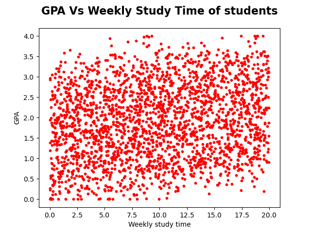
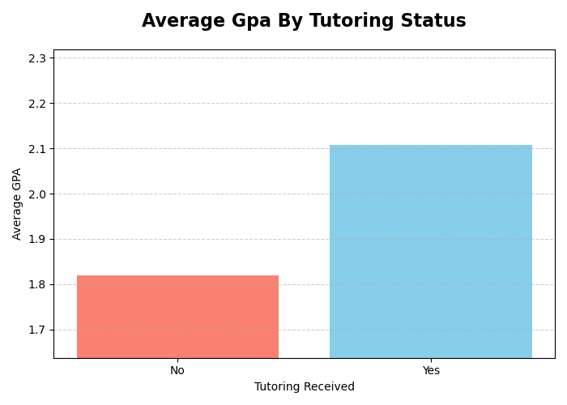

## 📚 Dataset Details: `Student_performance_data.csv`

### 1. Source and Overview

The data used for this analysis is sourced from the `Student_performance_data_.csv` file, originally referenced in the Kaggle notebook: [https://www.kaggle.com/code/annastasy/predicting-students-grades/input](https://www.kaggle.com/code/annastasy/predicting-students-grades/input)

> This dataset is a widely **available anonymized compilation** of **2,392 records** (Student ID from 1001 to 3392), often associated with secondary school student data (potentially sourced from a U.S. school context). It contains key attributes related to student performance, including **demographics, social factors, study habits, and final grades**.

---

### 2. Column Dictionary (Feature Descriptions)

This section details all 15 columns, including the necessary code mappings for the analysis.

#### Identification and Demographics

| Feature | Description | Range / Mapping |
| :--- | :--- | :--- |
| **StudentID** | A unique identifier assigned to each student. | 1001 to 3392 |
| **Age** | The age of the students. | 15 to 18 years |
| **Gender** | Gender of the students (Binary). | **0**: Male, **1**: Female |
| **Ethnicity** | The ethnicity of the students (Categorical). | **0**: Caucasian, **1**: African American, **2**: Asian, **3**: Other |

#### Parental and Social Factors

| Feature | Description | Mapping |
| :--- | :--- | :--- |
| **ParentalEducation** | The education level of the parents (Ordinal). | **0**: None, **1**: High School, **2**: Some College, **3**: Bachelor's, **4**: Higher |
| **ParentalSupport** | The level of parental support (Ordinal). | **0**: Very Low, **1**: Low, **2**: Moderate, **3**: High, **4**: Very High |

#### Study and Extracurricular Habits

| Feature | Description | Range / Mapping |
| :--- | :--- | :--- |
| **StudyTimeWeekly** | Weekly study time in hours (Continuous). | 0 to 20 hours |
| **Absences** | Number of absences during the school year. | 0 to 30 |
| **Tutoring** | Tutoring status (Binary). | **0**: No, **1**: Yes |
| **Extracurricular** | Participation in extracurricular activities (Binary). | **0**: No, **1**: Yes |
| **Sports** | Participation in sports (Binary). | **0**: No, **1**: Yes |
| **Music** | Participation in music activities (Binary). | **0**: No, **1**: Yes |
| **Volunteering** | Participation in volunteering (Binary). | **0**: No, **1**: Yes |

#### Academic Performance (Target Variables)

| Feature | Description | Mapping |
| :--- | :--- | :--- |
| **GPA** | **Grade Point Average** on a continuous scale. | 0.0 to 4.0 |
| **GradeClass** | **Target Variable:** Classification of final grades based on GPA (Ordinal). | **0**: 'A' (GPA $\geq 3.5$) / **1**: 'B' ($3.0 \leq$ GPA $< 3.5$) / **2**: 'C' ($2.5 \leq$ GPA $< 3.0$) / **3**: 'D' ($2.0 \leq$ GPA $< 2.5$) / **4**: 'F' (GPA $< 2.0$) |

---

## 🖼️ 3. Initial Data Inspection in Excel

### 3.1. CSV Load and Formatting (`Student_performance_data_visual.xlsx`)

The raw CSV file presented issues upon initial loading due to the US/UK format (dot `.` as decimal separator) conflicting with local Excel settings. This caused the numerical columns (**`StudyTimeWeekly`** and **`GPA`**) to display incorrect, long values.

The data was corrected using the "Text to Columns" feature, specifying the dot as the decimal separator, and the file was saved as **`Student_performance_data_visual.xlsx`** for visual inspection.


*Figure 1: Initial load of the raw CSV in Excel, showing formatting issues in numerical columns before correction.*

---

### 3.2. Categorical Variable Decoding (`Student_performance_data_visual_text.xlsx`)

For maximum readability and initial analysis in Excel, the numeric codes (e.g., `0`, `1`, `2`) in columns like **`Ethnicity`**, **`ParentalEducation`**, **`Tutoring`**, and **`GradeClass`** were manually converted to their corresponding text labels (`Caucasian`, `High School`, `Yes`, `A`, etc.).

This conversion was performed using **IF or IFS formulas** (e.g., `=PIÙ.SE(...)`) directly in the spreadsheet columns. The result was saved as **`Student_performance_data_visual_text.xlsx`**.


*Figure 2: Data view after manual decoding of categorical variables in Excel, providing human-readable labels.*

> **⚠️ Note on Process & Next Steps:** Executing these numerous conversions using Excel formulas is a **manual, time-consuming, and inflexible process**. This approach is not suitable for automation or large-scale data analysis.
> 
> Therefore, for the upcoming analysis in **Pandas**, we will switch back to the original **`Student_performance_data.csv`** file. We will implement the same decoding and transformation logic **programmatically** using Python's Pandas library (`.map()`, `.replace()`, etc.). This method is faster, scalable, and fully reproducible.

---

## 4. 🐍 Data Analysis Setup (Pandas)

To ensure the analysis is scalable and fully reproducible, all subsequent steps use the original **`Student_performance_data.csv`** file and the Python library **Pandas**.

### 4.1. Loading and Decoding Raw Data

The numeric codes (e.g., `0`, `1`, `2`) from the raw data are transformed into human-readable text labels using Pandas' `.map()` function and **Conversion Dictionaries**. This process creates **five new decoded columns** while preserving the original numeric data.

| Original Column | Conversion Type | New Decoded Column |
| :--- | :--- | :--- |
| **Gender** | `{0: 'Male', 1: 'Female'}` | **Gender_Decoded** |
| **Ethnicity** | `{0: 'Caucasian', ...}` | **Ethnicity_Decoded** |
| **ParentalEducation** | `{0: 'None', ...}` | **Education_Decoded** |
| **Tutoring** | `{0: 'No', 1: 'Yes'}` | **Tutoring_Decoded** |
| **GradeClass** | `{0: 'A', 4: 'F'}` | **GradeClass_Decoded** |

The Python code below defines the conversion logic and applies it to the DataFrame:

```python
# Load CSV
df = pd.read_csv("Student_performance_data.csv")

# Conversion Dictionaries defined here...

# Apply Conversions
df['Ethnicity_Decoded'] = df['Ethnicity'].map(ethnicity_conversion)
# ... other conversions applied ...
```

### 4.2. Ethnicity Distribution Count

The following table summarizes the raw count of students for each ethnicity category, based on the 'Ethnicity_Decoded' column:

| Ethnicity Category   | Number of Students (Count) |
| :--- | :--- |
| **Caucasian**        | 1207                       |
| **African American** | 493                        |
| **Asian**            | 470                        |
| **Other**            | 222                        |
| **Total Students**   | 2392                       |

The analysis shows a clear **imbalance (skew)** in the dataset, with the Caucasian group representing over half of the student population.


*Figure 3: Distribution of student population by ethnicity. The chart visually confirms that the majority of students are in the Caucasian category, highlighting a demographic bias in the dataset.*

### 4.3. Demographic Distribution by Gender

To gain a deeper understanding of the dataset's composition, the student population count is **segmented by both Ethnicity and Gender**. This analysis reveals the distribution of males and females within each ethnic group.

### Segmentation Summary

The table below shows the exact breakdown of the student population across the two demographic dimensions:

| Ethnicity Category | Male (Count) | Female (Count) | Total |
| :--- | :--- | :--- | :--- |
| **Caucasian** | 598 | 609 | 1207 |
| **African American** | 240 | 253 | 493 |
| **Asian** | 238 | 232 | 470 |
| **Other** | 115 | 107 | 222 |
| **Total Students** | **1191** | **1201** | **2392** |

The total number of male (**1191**) and female (**1201**) students is nearly equal, indicating **gender balance** within the overall dataset.

### Python Implementation (`student_data_analysis.py`)

The chart is generated using the corrected Python code, which first enforces the desired X-axis order and then applies custom labels and colors to the gender segments.


*Figure 4: Distribution of the student population segmented by Ethnicity and Gender. The chart confirms that the gender ratio is relatively balanced across all ethnic categories.*

### 4.4 📊 GPA Analysis (Grade Point Average)

This section details the initial analysis of the student Grade Point Average (GPA) and its distribution across gender and ethnic groups.

---

#### 4.4.1 General and Gender-Specific GPA Statistics

The Python code first calculates the overall GPA statistics and then segments the minimum, maximum, and mean GPA by gender.

**Overall GPA:**
* **Min GPA:** 0.0
* **Max GPA:** 4.0
* **Mean GPA:** **1.906**

**Segmented GPA Statistics:**

| Statistic | Female | Male |
| :--- | :--- | :--- |
| **Min GPA** | 0.0 | 0.0 |
| **Max GPA** | 4.0 | 4.0 |
| **Mean GPA** | 1.894 | **1.919** |

> **Summary:** While the range is identical, the **Male group exhibits a slightly higher mean GPA ($1.919$)** compared to the Female group ($1.894$). The overall mean GPA suggests the data set leans towards a lower academic performance range.

---

#### 4.4.2 Segmented Average GPA by Ethnicity and Gender

To understand variations, the average GPA was segmented by combining both **Ethnicity** and **Gender**.

| Ethnicity | Gender | Average GPA |
| :--- | :--- | :--- |
| **African American** | Female | 1.8915 |
| | **Male** | **1.9994** |
| **Asian** | **Female** | **1.9467** |
| | Male | 1.8954 |
| **Caucasian** | Female | 1.8697 |
| | **Male** | **1.8823** |
| **Other** | Female | 1.9181 |
| | **Male** | **1.9825** |

> **Key Finding:** Males achieved a higher average GPA across almost all ethnic groups, with the **Asian** group being the sole exception where **Females outperformed Males**.

---

#### 4.4.3 Visualization: Average GPA by Ethnicity and Gender

The segmented data is visualized using a grouped bar chart.


*Figure 5: Average GPA segmented by Ethnicity and Gender. This visualization highlights the performance differences across subgroups.*

---

## 5. 📊 Grade Class Distribution (Histograms)

This section visualizes the distribution of student performance across the five **GradeClass** categories ('A' to 'F'). The values are presented as **relative frequencies (percentages)**, providing a clear overview of the performance breakdown in the entire dataset.

**Comment:**
The distribution reveals a strongly **left-skewed** profile, indicating that the majority of students fall into the lower performance categories. Specifically, **Grade F** represents the largest segment, accounting for **50.7%** of the student body. This is followed by **Grade D** at **17.2%** and **Grade C** at **16.3%**.

The highest performance categories are significantly smaller, with **Grade B** at **11.2%** and **Grade A** representing only **4.6%** of the population. This initial view highlights a critical performance gap that requires deeper analysis into correlating factors such as weekly study time and parental education.


---

## 📉 6. Correlation Analysis: GPA vs. Weekly Study Time

This section analyzes the relationship between the continuous variable **Weekly Study Time** (`StudyTimeWeekly`) and the primary academic performance metric, the **Grade Point Average** (`GPA`).

### Scatter Plot Visualization: `GPA Vs Weekly study time of students`



*Figure 7: Scatter plot showing the distribution of student GPA scores relative to their reported weekly study time.*

---

### 6.1. Findings and Interpretation

The analysis of the scatter plot reveals a crucial insight regarding academic performance in this dataset:

There is **no clear positive correlation** between the amount of time a student spends studying weekly and their final Grade Point Average. The dispersion of the data points is high, indicating that even students who study many hours can obtain low GPAs.

The fact that the scatter plot does not show a distinct upward trend (and shows several students with high study time and low GPA) strongly suggests that **weekly study time is not the single, determining factor** of academic performance in this specific dataset.

### 6.2. ❓ Possible Causes for Low GPA Despite High Study Time

The observation that students invest significant time in studying yet yield poor results suggests that other variables are playing a more influential role. Here are the possible contributing factors:

* **Quality of Study vs. Quantity:** The `StudyTimeWeekly` feature measures the **quantity** of hours dedicated to studying, not the **effectiveness** or **quality** of that time. A student might study 20 hours a week inefficiently, while another studies 10 hours with targeted focus.
* **Systemic Factors and Support (Reverse Causality):**
    * **Tutoring** (`Tutoring_Decoded`): A high study time may be an **effect**, not a cause. The student might be devoting many hours to study **because they are struggling** academically and are desperately trying to catch up. The low GPA is, in this case, the reason for the high study time, not the reverse.
    * **Parental Education** (`Education_Decoded`): The level of support, guidance, or preparation that parents can provide can influence the effectiveness of the study efforts.
* **The Weight of the 'F' Grade (50.7%):** As previously observed in Section 5, over half of the student body falls into the 'F' grade class. It is likely that a large portion of these struggling students is dedicating substantial hours in a desperate attempt to pass their courses, but without success due to the systemic or quality-related issues listed above.

---

## 🎓 7. Comparative Analysis: Average GPA by Tutoring Status

This analysis tests the hypothesis that receiving external support, specifically **Tutoring** (`Tutoring_Decoded`), is a stronger predictor of academic performance than simply the hours spent studying (as suggested by the weak correlation found in Section 6).

### Key Finding

| Tutoring Status | Average GPA |
| :--- | :--- |
| **No** | 1.819 |
| **Yes** | **2.108** |

Students who received tutoring achieved an **average GPA of 2.108**, which is significantly higher (approximately **+16%**) than students who did not receive tutoring (average GPA of 1.819).

### Visualization: `Average GPA By Tutoring Status`

 

*Figure 8: Bar plot comparing the average GPA of students who receive tutoring versus those who do not.*

---

### 7.1. Interpretation and Impact

The results provide a strong contrast to the findings from the previous section (GPA vs. Weekly Study Time):

1.  **Tutoring as a Positive Predictor:** Unlike raw study hours, the **Tutoring Status** shows a clear and positive relationship with the GPA. This strongly suggests that the **quality or targeted nature of study** (often provided by tutoring) is a far more influential factor than the mere quantity of time dedicated to studying.
2.  **Addressing the 'F' Grade Problem:** Given that the dataset is heavily skewed towards low performance (50.7% 'F' grades), the students receiving tutoring are successfully moving the average score above the 2.0 threshold (Grade D/C border), indicating that this support helps students overcome significant performance deficits.
3.  **Hypothesis Validation:** The initial hypothesis is **validated**: the presence of support (`Tutoring`) is a better predictor of improved performance than the quantitative metric of `StudyTimeWeekly`.